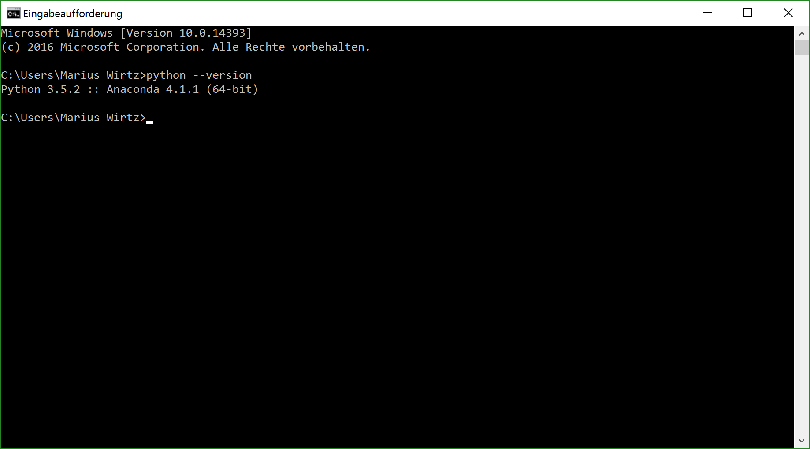
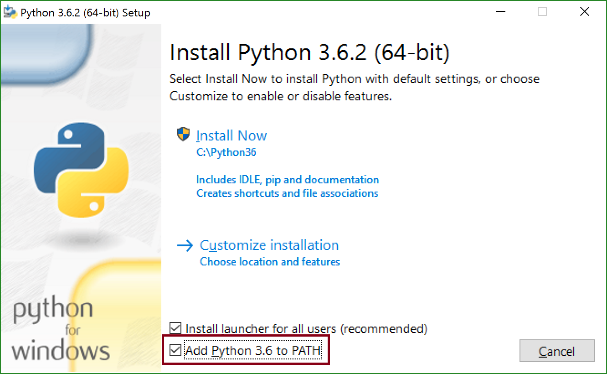
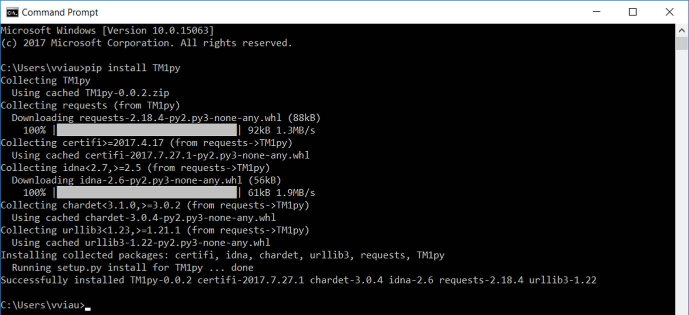
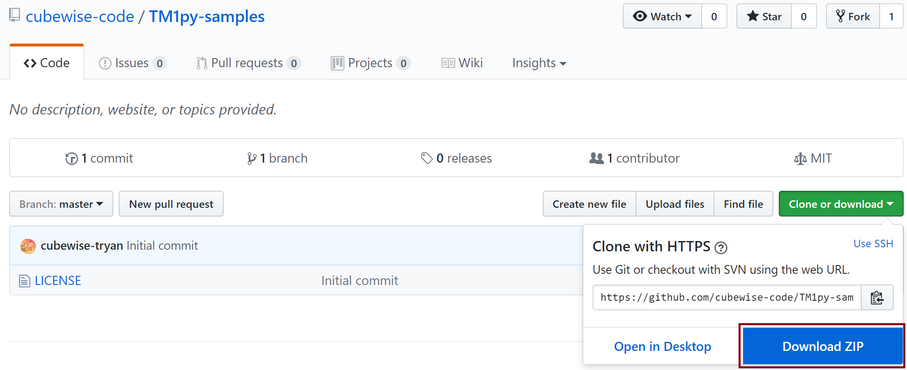
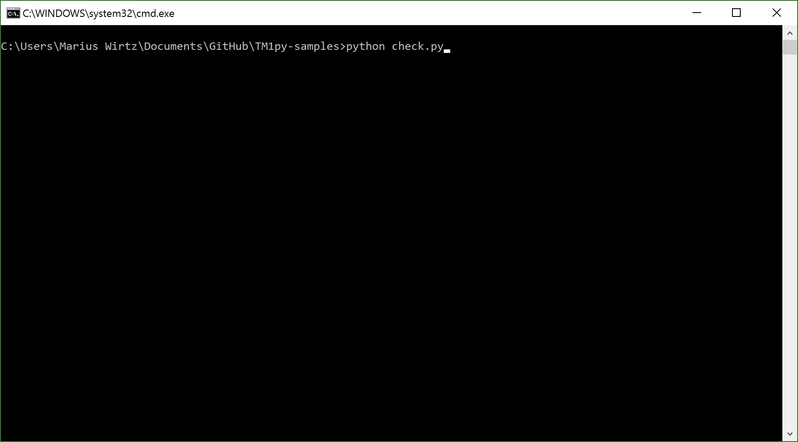

TM1py-samples
=======================

TM1py-samples has heaps of cool stuff that you can do with TM1py:

- load TM1 data into pandas for statistical analysis
- load FX, Stock and GDP data from external sources into your cubes
- synchronize cubes from different TM1 instances
- clean your TM1 models through regular expressions
- generate MDX Queries from existing cube views
- Analyse Processing Feeders time
- Maintain dimensions and subsets with python
- ...

It's a great starting point to get up to speed with TM1py.

Requirements
=======================

- Python    (3.5 or higher)
- TM1       (10.2.2 FP 5 or higher)

Step by Step Installation
==============================================

1. Install Python
~~~~~~~~~~~~~~~~~~~~~~~~~~~~~~~~~~~~~~~~~~~~~~

The TM1py samples will run on all Python versions >= 3.5.

First, we need to check if you have python installed. Open the command-line and type: python --version.

To open the command-line, press the windows button on the keyboard. Then type 'cmd'. Then press enter.

This will print out the installed version of Python. If it gives you an error, or your version is lower than 3.5 you need to download python.

Python for Windows installer (32 and 64 bit):

https://www.python.org/ftp/python/3.6.2/python-3.6.2-amd64.exe

Python (3.6) installation walkthrough on Youtube:

https://www.youtube.com/watch?v=dX2-V2BocqQ

You have to make sure, you check the "Add Python 3.6 to PATH" Checkbox in the installation!

This allows you to run Python stuff more easily in the future through the command-line.

To check if the installation was successful just type

 .. code-block:: bash

    Python --version

one more time into the command-line.
This will print out the installed version of Python if the installation was successful.

2. Configure the TM1 REST API
~~~~~~~~~~~~~~~~~~~~~~~~~~~~~~~~~~~~~~~~~~~~~~

TM1py requires at least TM1 version 10.2.2 FP5. If you consider using the REST API in production it is recommended to upgrade to TM1 10.2.2 FP 7 or TM1 11.

In order to be able to communicate with TM1 through HTTP, you have to assign an HTTP port number to TM1 in the tm1s.cfg file

 .. code-block:: bash

    HTTPPortNumber=8002

The parameter will only be effective after restarting the TM1 instance.

For a more detailed tutorial on how to enable the TM1 REST API, check out the following article:

https://code.cubewise.com/blog/enabling-the-tm1-rest-api

3. Check Connectivity to TM1 from the Browser
~~~~~~~~~~~~~~~~~~~~~~~~~~~~~~~~~~~~~~~~~~~~~~

Before we move on, we have to make sure that we can access TM1 through the REST API.
The easiest way to do this is through the Browser (preferably Chrome)

Copy and paste the following request into your browser

http://localhost:8002/api/v1/$metadata

We might have to adjust 3 things here.

1. http has to be replaced by https if the USESSL parameter in the tm1s.cfg is set to T.

2. localhost has to replaced by the address of the Server where the TM1 instance runs.

3. 8002 has to be replaced by the HTTPPortNumber that is specified in the tm1s.cfg.

If the request is successfull it will show the metadata document (XML) of the TM1 REST API in the browser.

4. Install TM1py
~~~~~~~~~~~~~~~~~~~~~~~~~~~~~~~~~~~~~~~~~~~~~~

To install TM1py, simply type: pip install TM1py

into the command-line. pip (the Python package management system) will download the TM1py package and its requirements from PyPI and store it at the third party module folder ..Python\\Lib\\site-packages\\TM1py

If Python is installed correctly it should work without issues. Otherwise type:

 .. code-block:: bash

    C:\Python36\Scripts\pip.exe TM1py

into the command-line.
If that doesn't work either, try reinstalling Python from scratch.

As a fallback you can download the latest TM1py release from GitHub and place it in the \site-packages folder manually.
This is not recommended though, as it doesn't take care of the dependencies!

5. Download TM1py-samples from Github
~~~~~~~~~~~~~~~~~~~~~~~~~~~~~~~~~~~~~~~~~~~~~~

Now that TM1py is set up successfully, you can download the TM1py samples manually from Github.

To download the samples just go to https://github.com/cubewise-code/TM1py-samples

Then click on Clone or download

Then click on "Download ZIP"

6. Check Connectivity to TM1 from TM1py
~~~~~~~~~~~~~~~~~~~~~~~~~~~~~~~~~~~~~~~~~~~~~~

In order to check if TM1py works with your TM1 instance,
navigate to the TM1py-samples folder that you downloaded from Github.
Hold shift and right-click into the folder. Then select "Open command window here". This should open the command-line (or PowerShell depending on your Windows version).
Now type "python check.py" into the console to execute the check.py script.

The script will ask you for:

- user      (Name of the TM1 User)
- password  (The user's password. The command-line reads your input silently)
- port      (The HTTPPortNumber as specified in the TM1s.cfg)
- address   (Address of the TM1 instance. 'localhost' or '' if you run the TM1 instance locally)
- ssl       (True or False, as stated in the TM1s.cfg)

.. image:: Images/runCheckParameters.png

TM1py will then try to connect to your TM1 instance.

It will print out the name of the TM1 instance. If this works without Errors you should be able run any of the samples.
All the samples are based on the Planning Sample TM1 model, that comes with the installation of TM1.
The samples potentially contain hard coded references to TM1 objects (e.g. cube names).
Make sure to adjust those references if you are not testing against the Planning Sample!

If something doesn't work as expected in the installation, feel free to open an issue in Github.

Usage
=======================

My first Python TM1 script
~~~~~~~~~~~~~~~~~~~~~~~~~~~~~~~~~~~~~~~~~~~~~~

Find all unused dimensions with TM1py

.. code-block:: Python

    # Housekeeping: import TM1 Service
    from TM1py.Services import TM1Service

    # Connect to TM1. Requires a few parameters to connect:
    # - address: Address of the machine. 'localhost' or '' if you run the TM1 instance locally
    # - port: HTTPPortNumber as specified in the TM1s.cfg
    # - user: The TM1 user
    # - password: Password of the user
    # - ssl: True or False, as stated in the TM1s.cfg
    with TM1Service(address='', port=8001, user='admin', password='apple', ssl=True) as tm1:
       # Ask TM1 to return the names of all existing dimensions
       all_dimensions = tm1.dimensions.get_all_names()
       # Ask TM1 to return the names of all existing dimensions
       all_cubes = tm1.cubes.get_all()
       # Now find all dimensions that are actually being used in cubes
       # Create a Set (in Python: a list of unique elements)
       used_dimensions = set()
       # Populate the set: iterate Ithrough the list of cubes and push each cube's dimensions into the set
       for cube in all_cubes:
          used_dimensions.update(cube.dimensions)
       # Determine the unused dimensions: The delta between all dimensions and the used dimensions
       unused_dimensions = set(all_dimensions) - used_dimensions
       # Print out the unused dimensions
       print(unused_dimensions)

Documentation
=======================

http://tm1py.readthedocs.io/en/latest/

Other
=======================

Python Tutorial
~~~~~~~~~~~~~~~~~~~~~~~~~~~~~~~~~~~~~~~~~~~~~~

If you are not familiar with the Python programming language you might want to look into some basic tutorials,
before starting with TM1py.
thenewboston offers awesome (and free) Python tutorials on his Youtube Channel
https://www.youtube.com/playlist?list=PL6gx4Cwl9DGAcbMi1sH6oAMk4JHw91mC_

IDE
~~~~~~~~~~~~~~~~~~~~~~~~~~~~~~~~~~~~~~~~~~~~~~

PyCharm is likely the best IDE for Python. It offers intelligent code completion, on-the-fly error checking and heaps of other features.
It allows you to save time and be more productive.
IntelliJ offers a free Community Edition of PyCharm
https://www.jetbrains.com/pycharm/

Issues
=======================

If you find issues, sign up in Github and open an Issue in this repository

Contribution
=======================

If you wrote cool sample scripts with TM1py, that might be useful for others, feel free to push them to the repository